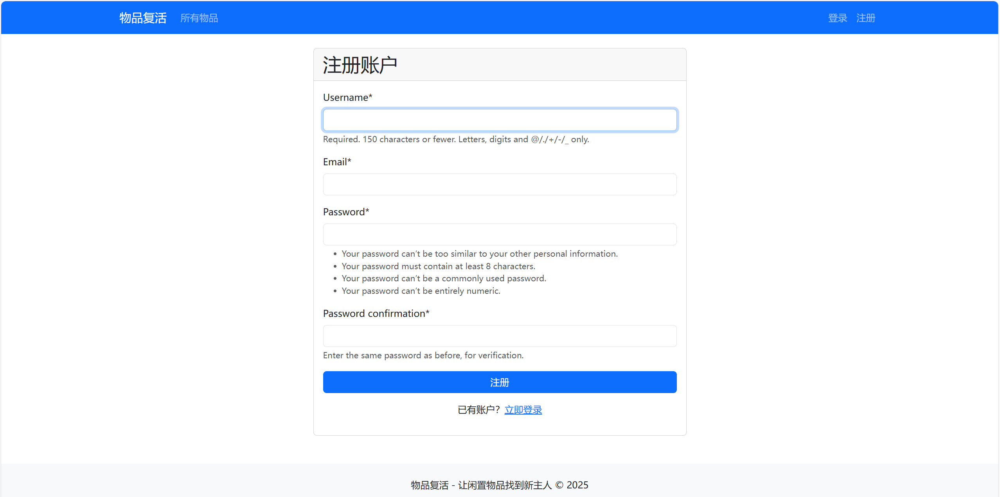
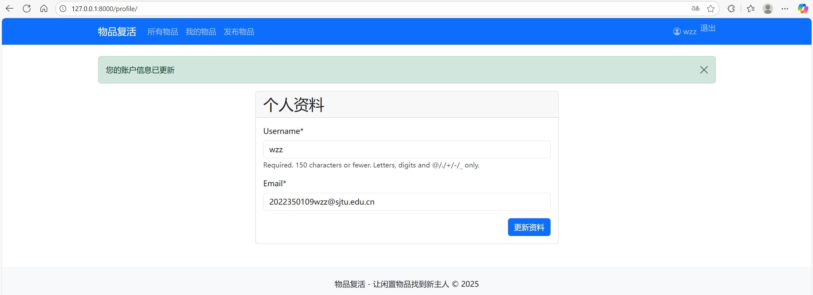
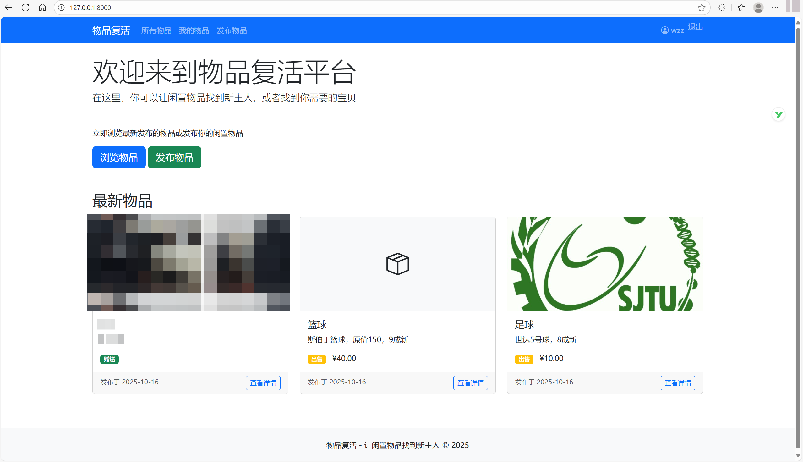
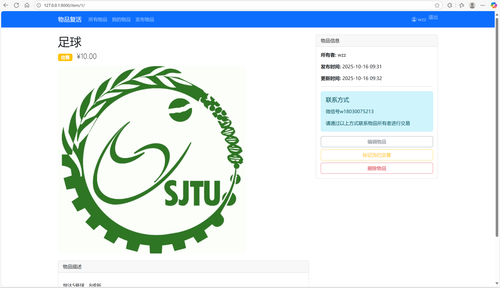
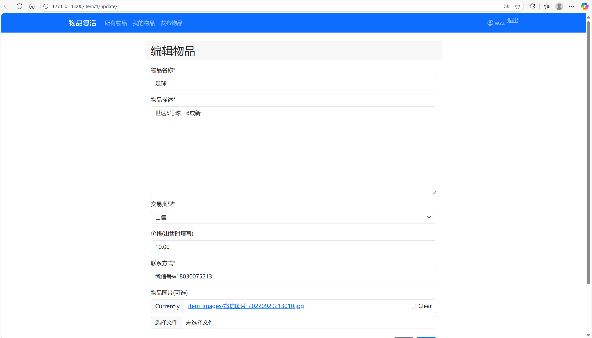

# ItemRevive - 闲置物品共享平台

**A web application developed as a course project for Software Engineering**, designed to manage and revive unused items through a community-driven platform.

**项目类型**: 课程设计（软件工程方向）

**开发环境**: WSL2 + Python + Django

**项目状态**: 已实现核心功能（注册/登录、物品管理、浏览筛选）


## 1. 项目功能概述

### **核心功能**

1. 用户认证
   - 用户注册与登录（基于 Django 内置认证系统）。
   - 密码加密存储（使用 Django 的 `PBKDF2` 算法）。
2. 物品管理
   - 上传物品：填写物品描述、上传图片（支持多图）、填写联系方式（邮箱/电话）。
   - 编辑物品：修改物品信息或图片。
   - 状态设置：标记物品为“已出售”或“已赠送”。
3. 物品浏览与筛选
   - 浏览所有用户上传的物品列表（分页显示）。
   - 按类型筛选（售卖/赠送）。


## 2. 技术架构

### 后端框架

- Django (Python)
  - 使用 Django 的 MTV 模式（Model-Template-View）。
  - 核心组件：
    - `django.contrib.auth`：用户认证系统。
    - `django.db.models`：物品信息的数据模型。
    - `django.forms`：处理物品上传/编辑的表单。
    - `django.views`：实现物品列表、详情页等逻辑。

### 前端实现

- HTML/CSS + Bootstrap 5
  - 响应式布局，适配桌面和移动端。
  - 使用 Bootstrap 组件（卡片、表单、导航栏）。

### 数据库

- SQLite
  - Django 默认数据库，轻量级且无需额外配置。

### 部署与扩展（待实现）

- Linux 服务器部署
  - 使用 `Gunicorn` + `Nginx` 部署 Django 应用。
  - 静态文件托管（如 AWS S3 或本地存储）。

### 可视化








## 3. 使用方法

### 3.1 本地运行（开发环境）

- Linux / WSL2
- 包管理工具 conda

步骤

1. **克隆仓库**

   ```bash
   git clone https://github.com/Zhenzhi-Wang-2004/item_revive.git # 在当前的目录中，会自动创建一个名为item_revive的目录
   cd item_revive
   ```

2. **创建并激活虚拟环境**

   ```bash
   conda create -n Djangotest python=3.13.7
   source activate Djangotest
   ```

3. **安装依赖**

   ```bash
   conda install Django
   conda install -c conda-forge django-crispy-forms
   conda install Pillow
   conda install -c conda-forge crispy-bootstrap5
   ```

6. **运行开发服务器**

   ```bash
   python manage.py runserver
   ```
   
   - 浏览器中访问 `http://127.0.0.1:8000` 查看应用。


### 3.2 用户操作指南

#### 注册与登录

1. 访问首页，点击**注册**或**登陆**。
2. 登录后进入个人仪表盘。

#### 上传物品

1. 点击导航栏 **发布物品**。
2. 填写表单：
   - 物品名称、描述、交易类型（售卖/赠送）、价格（售卖）。
   - 上传图片（支持 JPG/PNG 等格式）。
   - 填写联系方式（邮箱或电话）。
3. 提交后物品将出现在公共列表中。

#### 编辑物品

1. 在个人仪表盘找到**我的物品**，点击**查看详情**，进入物品页面，再点击**编辑物品**。
2. 修改信息后保存。

#### 浏览与筛选

1. 访问首页，点击**浏览物品**。
2. 使用顶部筛选器选择**赠送**或**出售**。
3. 点击物品卡片查看详情。
