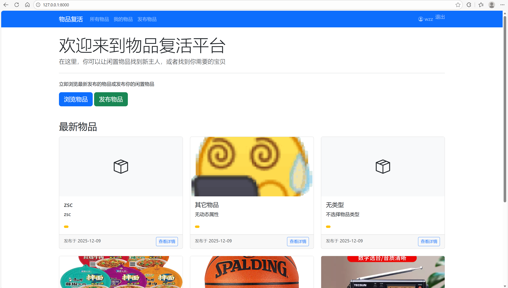
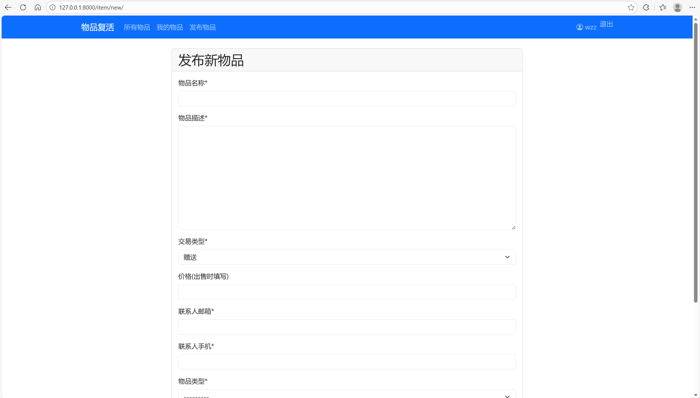
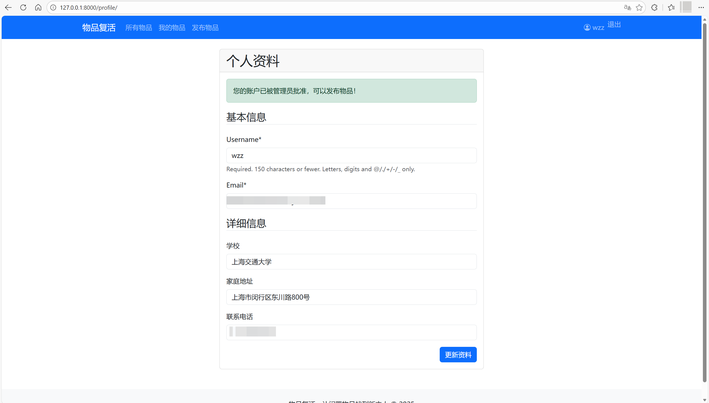
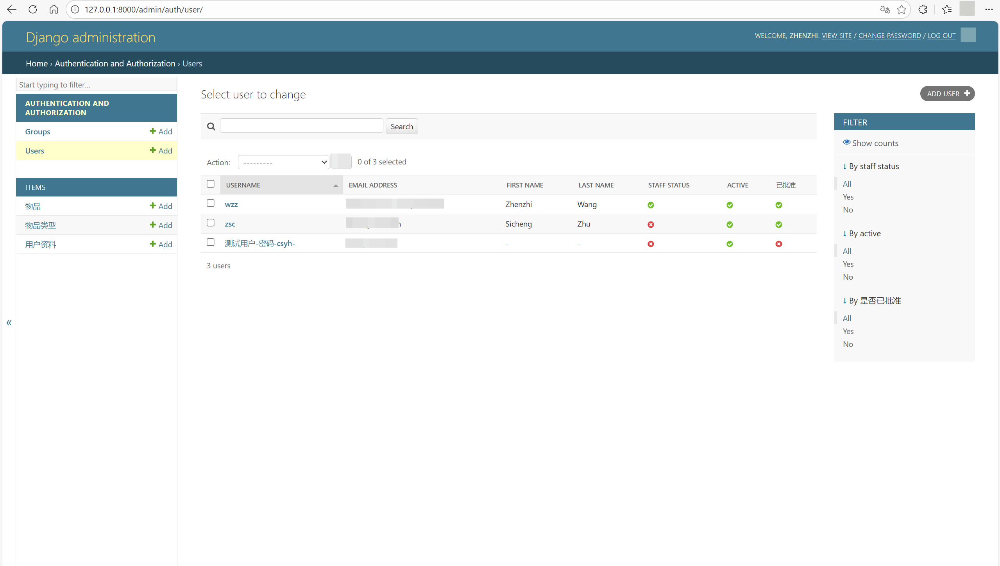
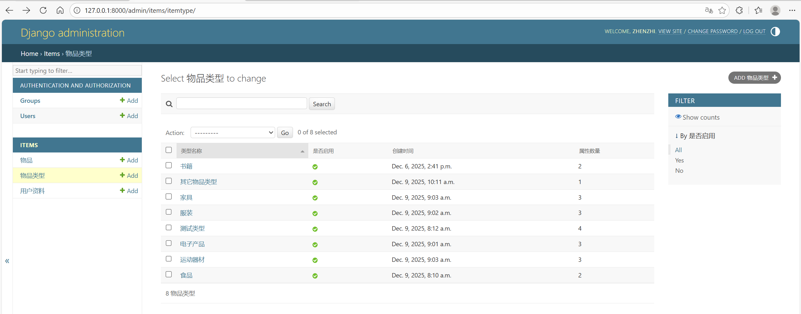
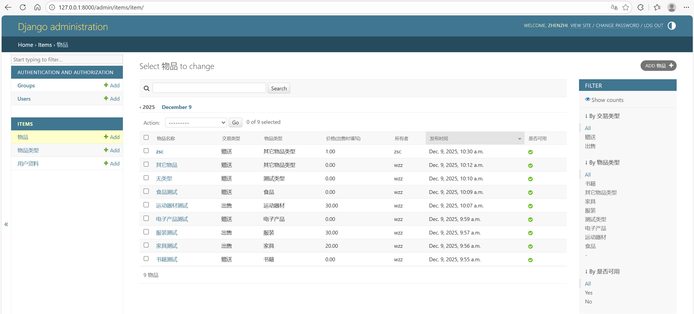

# ItemRevive - 闲置物品共享平台

ItemRevive是一个功能完整、技术先进的闲置物品共享平台。项目采用Django框架开发，具有良好的可扩展性、安全性和用户体验。
该项目不仅满足了闲置物品共享的实际需求，还展示了软件工程的核心思想和最佳实践，包括需求分析、系统设计、数据库设计、前端实现和后端开发等方面。通过动态属性管理系统，为用户提供了更加灵活和高效的物品管理体验。

**项目类型**: 课程设计（软件工程方向）

**开发环境**: Windows / WSL2 + Python + Django

**技术栈**: Django 4.x + HTML/CSS + Bootstrap 5 + SQLite

**项目状态**: 已实现完整功能（用户认证、动态物品管理、智能筛选、响应式设计）


## 1. 项目功能概述

### 核心功能

1. **用户认证与管理**
   - 用户注册、登录、管理（基于 Django 内置认证系统）。
   - 密码加密存储（使用 Django 的 `PBKDF2` 算法）。
   - 用户审批机制：新用户需管理员批准后方可使用完整功能。
   - 个人资料管理：支持编辑用户信息（用户名、邮箱、学校、家庭地址、联系电话等）。

2. **动态物品管理系统**
   - **灵活的物品类型定义**：支持管理员自定义物品类型（如书籍、电子产品、食品等）。
   - **动态属性字段**：每种物品类型可配置独特的属性字段（如书籍的作者、出版社）。
   - **物品发布与编辑**：
     - 上传物品：填写物品信息、上传图片、选择交易类型（售卖/赠送）。
     - 编辑物品：修改物品信息、图片或动态属性。
   - **状态管理**：
     - 标记物品为可用/不可用（已出售/已赠送）。
     - 物品删除：所有者可删除自己发布的物品。

3. **物品浏览与筛选**
   - **物品列表**：分页显示所有可用物品（每页12个）。
   - **多维度筛选**：
     - 交易类型筛选：支持按"赠送"或"出售"类型筛选。
     - 类别筛选：可按物品类别进行筛选。
     - 关键词搜索：支持按物品名称和描述进行搜索。
   - **首页推荐**：展示最新的6个可用物品。
   - **个人物品管理**：用户可查看和管理自己发布的所有物品。


## 2. 技术架构

### 后端框架

- **Django (Python)**：采用 MTV（Model-Template-View）模式
  - **核心组件**：
    - `django.contrib.auth`：用户认证系统，提供注册、登录、权限管理等功能。
    - `django.db.models`：ORM框架，定义数据模型与数据库交互。
    - `django.forms`：表单系统，包括动态表单生成和验证。
    - `django.views`：视图层，结合类视图（ListView、DetailView、CreateView等）和函数视图实现业务逻辑。
    - `django.urls`：URL路由配置，将请求映射到相应的视图。
    - `django.contrib.messages`：消息系统，用于用户操作反馈。
  - **关键依赖**：
    - `django-crispy-forms`：表单样式美化，支持Bootstrap 5。
    - `Pillow`：图片处理库，用于物品图片上传和处理。

### 前端实现

- **HTML5/CSS3 + Bootstrap 5**
  - 响应式布局设计，完美适配桌面和移动端设备。
  - 使用 Bootstrap 组件库：
    - 卡片组件：用于物品列表和详情展示。
    - 表单组件：用于用户注册、物品发布等功能。
    - 导航栏组件：提供网站全局导航。
    - 模态框组件：用于确认操作和提示信息。
  - **JavaScript/AJAX**：实现动态属性加载和表单交互效果。

### 数据库设计

- **SQLite**：Django默认轻量级数据库，适合开发和小型应用

#### 核心数据模型

1. **用户模型**
   - `User`（Django内置）：存储用户基本信息（用户名、邮箱、密码等）
   - `Profile`（用户扩展）：存储额外用户信息（学校、家庭地址、联系电话、审批状态）

2. **物品类型与属性模型**
   - `ItemType`：定义物品类型（如书籍、电子产品），包含名称、启用状态等字段
   - `Attribute`：定义每种物品类型的属性字段，包含：
     - 所属类型（外键关联ItemType）
     - 属性名称
     - 字段类型（文本、长文本、数字、日期）
     - 是否必填
     - 显示顺序

3. **物品信息模型**
   - `Item`：存储物品基本信息和动态属性
     - 物品名称、描述、交易类型（赠送/出售）、价格
     - 联系人信息（邮箱、电话）
     - 所属用户（外键关联User）
     - 物品类型（外键关联ItemType）
     - 动态属性（JSONField存储不同类型物品的特有属性）
     - 物品图片（ImageField）
     - 可用性状态（is_available）
     - 创建和更新时间

### 部署与扩展

- **开发环境**：WSL2 + Python + Django
- **生产环境部署（待实现）**：
  - Linux 服务器 + Gunicorn + Nginx
  - 数据库可升级为 PostgreSQL 或 MySQL 
  - 静态文件和媒体文件可托管至 CDN 或云存储服务（如 AWS S3）

### 用户界面展示








## 3. 项目结构

### 目录结构

```
itemwzz/                 # 项目根目录
├── items/              # 主要应用目录
│   ├── migrations/     # 数据库迁移文件
│   ├── templates/      # HTML模板文件
│   │   ├── items/      # 物品相关模板
│   │   └── registration/ # 登录注册模板
│   ├── __init__.py     # 应用初始化文件
│   ├── admin.py        # Django后台管理配置
│   ├── apps.py         # 应用配置
│   ├── forms.py        # 表单定义（包括动态表单）
│   ├── models.py       # 数据模型定义
│   ├── tests.py        # 单元测试文件
│   ├── urls.py         # 应用路由配置
│   └── views.py        # 视图逻辑实现
├── itemwzz/            # 项目配置目录
│   ├── __init__.py     # 项目初始化文件
│   ├── asgi.py         # ASGI配置（异步服务器网关接口）
│   ├── settings.py     # 项目设置（数据库、中间件、应用等）
│   ├── urls.py         # 主路由配置
│   └── wsgi.py         # WSGI配置（Web服务器网关接口）
├── media/              # 媒体文件存储
│   └── item_images/    # 物品图片存储目录
├── readme-images/      # README文档图片存储
├── db.sqlite3          # SQLite数据库文件
├── manage.py           # Django管理脚本
└── README.md           # 项目说明文档
```

### 主要文件说明

1. **items/forms.py**：定义所有表单类，包括动态物品表单(DynamicItemForm)、用户注册表单(UserRegisterForm)等
2. **items/models.py**：定义数据模型，包括Item、ItemType、Attribute、Profile等
3. **items/views.py**：实现业务逻辑，包括物品管理、用户管理、属性加载等视图
4. **items/urls.py**：配置应用路由，映射URL到相应的视图
5. **items/templates/**：包含所有HTML模板文件，实现前端界面
6. **itemwzz/settings.py**：项目全局设置，包括数据库配置、安装的应用、中间件等
7. **manage.py**：Django管理命令行工具，用于运行开发服务器、数据库迁移等操作


## 4. 使用方法

### 4.1 本地运行（开发环境）

**系统要求**：Linux / WSL2
**包管理工具**：conda 或 pip

#### 步骤

1. **克隆仓库**（如果尚未下载）

   ```bash
   git clone https://github.com/Zhenzhi-Wang-2004/item_revive.git # 在当前的目录中，会自动创建一个名为item_revive的目录
   cd itemwzz
   ```

2. **创建并激活虚拟环境**

   - 使用 conda：
     ```bash
     conda create -n Djangotest python=3.10
     source activate Djangotest

3. **安装依赖**

   - 使用 conda：
     ```bash
     conda install Django
     conda install -c conda-forge django-crispy-forms
     conda install Pillow
     conda install -c conda-forge crispy-bootstrap5
     ```

4. **数据库迁移**（如果是首次运行或模型有更新）

   ```bash
   python manage.py migrate
   ```

5. **创建超级用户**（用于管理用户审批和系统设置）

   ```bash
   python manage.py createsuperuser
   ```
   
   按照提示输入用户名、邮箱和密码。

6. **运行开发服务器**

   ```bash
   python manage.py runserver
   ```
   
   - 浏览器中访问 `http://127.0.0.1:8000` 查看应用。
   - 访问 `http://127.0.0.1:8000/admin` 进入管理员后台（使用超级用户账号登录）。


### 4.2 用户操作指南

#### 注册与登录

1. 访问首页，点击导航栏的**注册**或**登录**按钮。
2. **注册**：填写用户名、邮箱、密码、学校、家庭地址和联系电话，然后点击注册。
3. **登录**：使用注册的用户名和密码登录。
4. 新用户注册后，需要等待管理员在后台审批通过后才能发布物品。

#### 个人资料管理

1. 登录后，点击导航栏的**个人资料**进入个人资料页面。
2. 可以编辑用户名、邮箱、学校、家庭地址和联系电话等信息。
3. 点击**保存**按钮更新资料。

#### 物品发布与管理

1. **发布物品**：
   - 登录后，点击导航栏的**发布物品**按钮。
   - 选择物品类型（如书籍、电子产品等）。
   - 根据选择的物品类型，填写相应的动态属性（如书籍的作者、出版社）。
   - 填写物品名称、描述、交易类型（售卖/赠送）、价格（仅售卖时需要）。
   - 上传物品图片（支持 JPG/PNG 等格式）。
   - 填写联系人邮箱和电话。
   - 点击**发布**按钮提交物品。

2. **查看我的物品**：
   - 登录后，点击导航栏的**我的物品**查看所有已发布的物品。
   - 可以分页浏览自己发布的所有物品。

3. **编辑物品**：
   - 在**我的物品**页面或物品详情页，点击**编辑物品**按钮。
   - 修改物品信息、图片或动态属性。
   - 点击**保存**按钮更新物品信息。

4. **标记物品为不可用**：
   - 在物品详情页，点击**标记为已出售/已赠送**按钮。
   - 物品将被标记为不可用状态，不再显示在公共列表中。

5. **删除物品**：
   - 在物品详情页，点击**删除物品**按钮。
   - 确认后物品将被永久删除。

#### 物品浏览与筛选

1. **浏览所有物品**：
   - 点击导航栏的**浏览物品**查看所有可用物品。
   - 物品按创建时间倒序排列，每页显示12个物品。

2. **多维度筛选**：
   - **交易类型筛选**：使用顶部筛选器选择**赠送**或**出售**类型。
   - **类别筛选**：选择特定的物品类别进行筛选。
   - **关键词搜索**：在搜索框中输入关键词，按名称和描述搜索物品。

3. **查看物品详情**：
   - 点击物品卡片进入物品详情页。
   - 可以查看物品的详细信息、图片和联系方式。
   - 可以与物品所有者联系（通过提供的邮箱或电话）。

#### 管理员操作指南

1. **登录管理员后台**：访问 `http://127.0.0.1:8000/admin`，使用超级用户账号登录。

2. **用户管理**：
   - 在**认证和授权**下点击**用户**查看所有用户。
   - 可以编辑用户信息、重置密码或删除用户。

3. **用户审批**：
   - 在**items**下点击**用户资料**查看所有用户资料。
   - 找到需要审批的用户，编辑其资料，将**是否已批准**设置为**是**。
   - 点击**保存**完成审批。

4. **物品类型和属性管理**：
   - 在**items**下点击**物品类型**查看和管理所有物品类型。
   - 可以添加新的物品类型或编辑现有类型。
   - 在**items**下点击**属性字段**查看和管理所有属性字段。
   - 可以为不同的物品类型添加或编辑属性字段。


