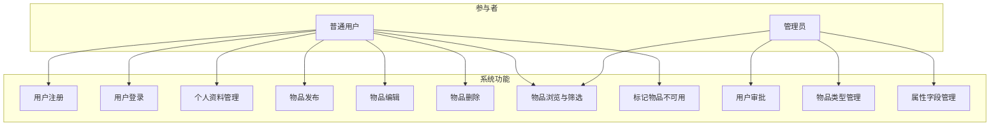
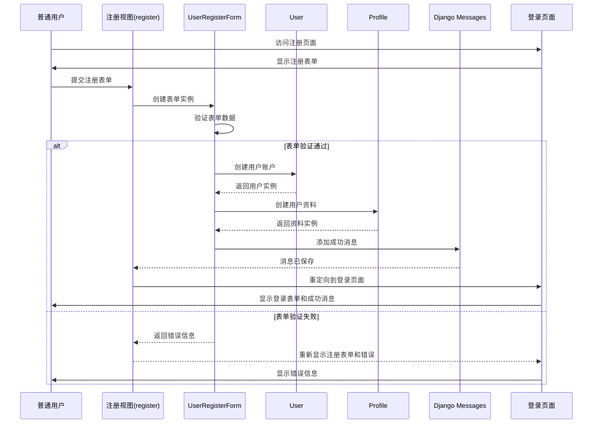
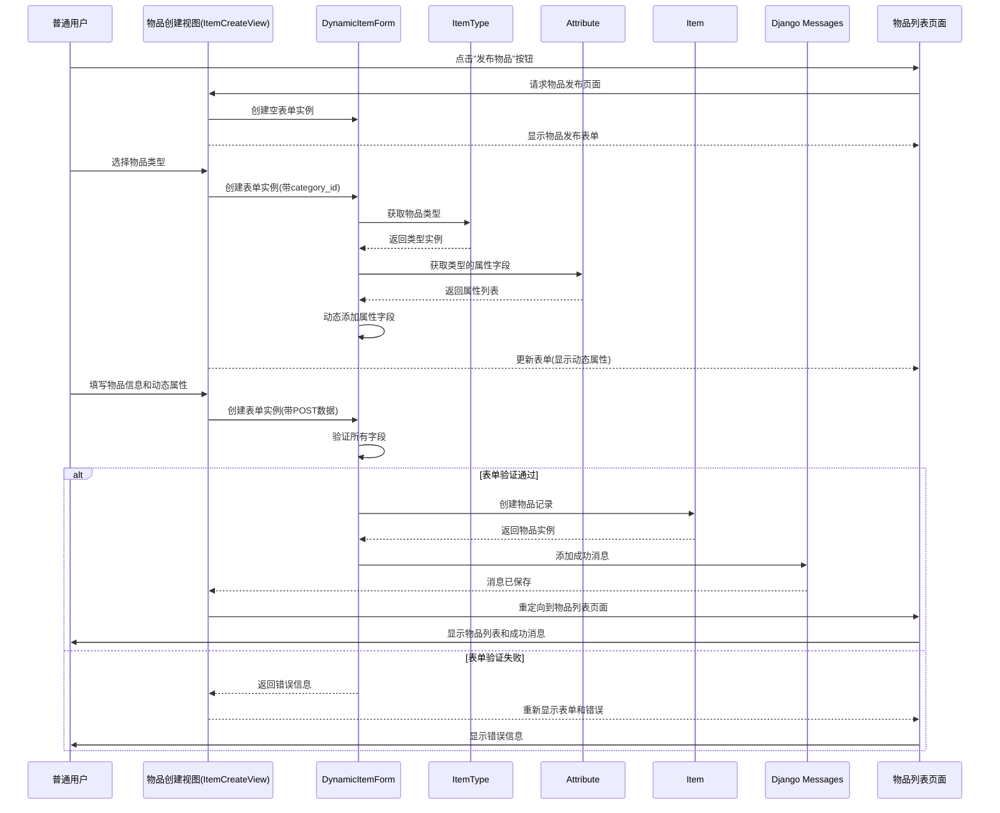
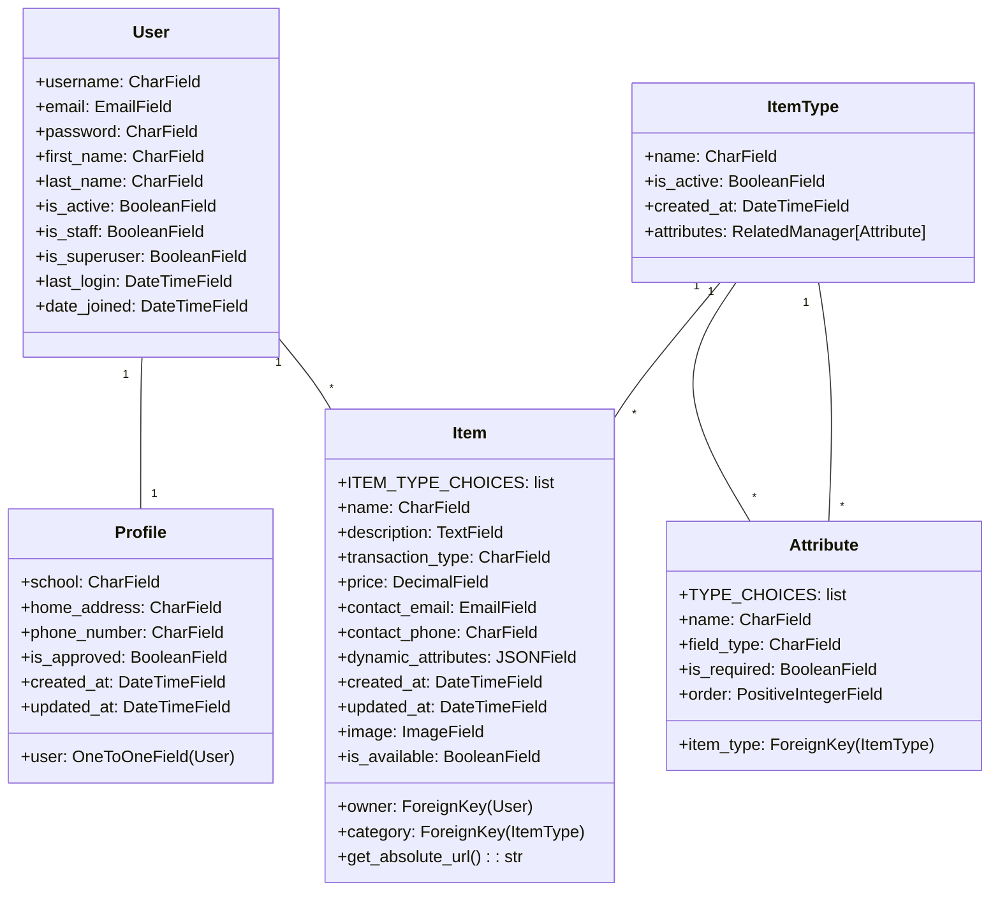
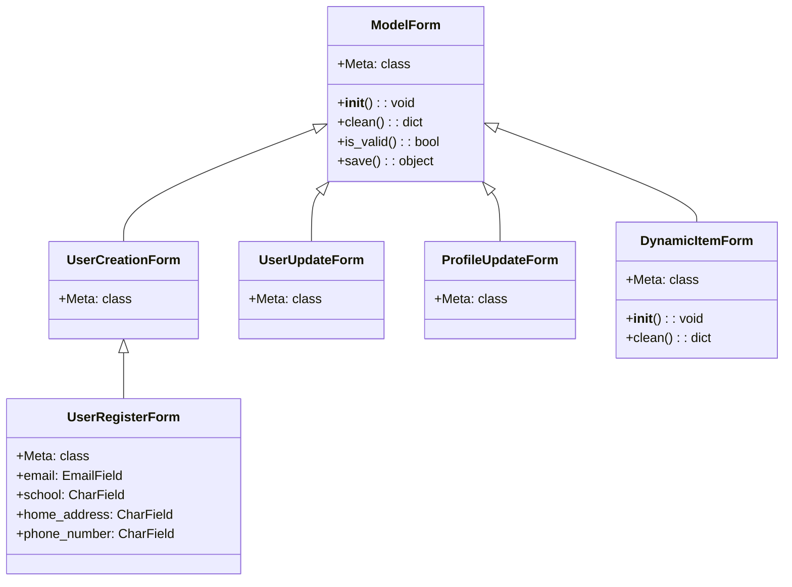
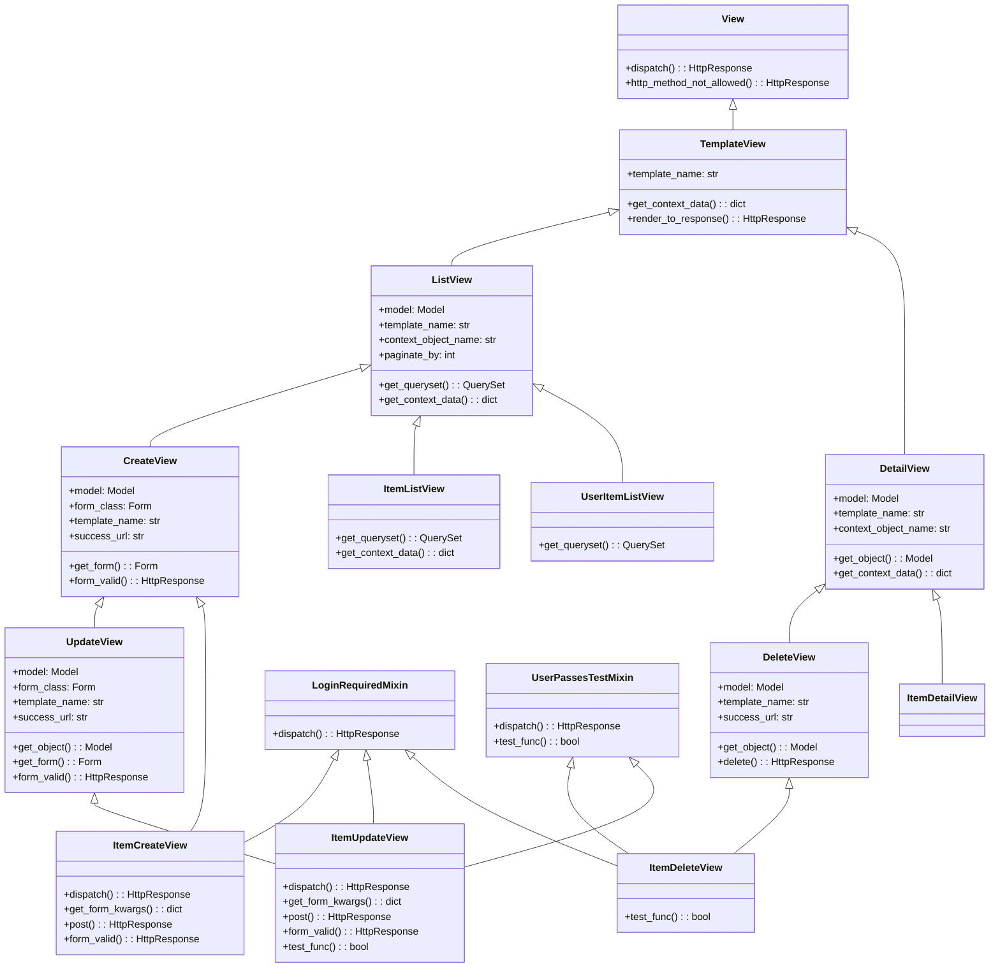

# ItemRevive 闲置物品共享平台 - 系统设计文档

## 1. 用例模型

### 1.1 参与者识别

| 参与者 | 描述 |
|-------|------|
| **普通用户** | 平台的注册用户，可以发布、管理和浏览闲置物品 |
| **管理员** | 平台的管理人员，负责审批用户、管理物品类型和属性 |

### 1.2 用例图

### 1.3 用例描述

#### 1.3.1 用户注册 (UC1)

| 要素 | 描述 |
|------|------|
| **参与者** | 普通用户 |
| **前置条件** | 无 |
| **后置条件** | 用户账户创建成功，等待管理员审批 |
| **基本流程** | 1. 用户填写注册表单（用户名、邮箱、密码、学校、家庭地址、联系电话） 2. 系统验证表单数据 3. 系统创建用户账户和个人资料 4. 系统发送成功消息，提示等待审批 |

#### 1.3.2 用户登录 (UC2)

| 要素 | 描述 |
|------|------|
| **参与者** | 普通用户 |
| **前置条件** | 用户已注册且账户已被批准 |
| **后置条件** | 用户成功登录系统 |
| **基本流程** | 1. 用户输入用户名和密码 2. 系统验证凭证 3. 系统验证用户账户是否已批准 4. 用户登录成功，进入系统 |

#### 1.3.3 个人资料管理 (UC3)

| 要素 | 描述 |
|------|------|
| **参与者** | 普通用户 |
| **前置条件** | 用户已登录 |
| **后置条件** | 用户资料更新成功 |
| **基本流程** | 1. 用户访问个人资料页面 2. 用户编辑个人信息 3. 系统验证表单数据 4. 系统更新用户资料 5. 系统发送成功消息 |

#### 1.3.4 物品发布 (UC4)

| 要素 | 描述 |
|------|------|
| **参与者** | 普通用户 |
| **前置条件** | 用户已登录且账户已被批准 |
| **后置条件** | 物品发布成功 |
| **基本流程** | 1. 用户点击"发布物品" 2. 用户选择物品类型 3. 系统动态加载该类型的属性字段 4. 用户填写物品信息和动态属性 5. 用户上传物品图片 6. 系统验证表单数据 7. 系统创建物品记录 8. 系统发送成功消息 |

#### 1.3.5 物品编辑 (UC5)

| 要素 | 描述 |
|------|------|
| **参与者** | 普通用户 |
| **前置条件** | 用户已登录且是物品的所有者 |
| **后置条件** | 物品信息更新成功 |
| **基本流程** | 1. 用户访问物品详情页面 2. 用户点击"编辑物品" 3. 系统显示编辑表单，包含当前物品信息 4. 用户修改物品信息 5. 如果修改物品类型，系统重新加载动态属性 6. 系统验证表单数据 7. 系统更新物品记录 8. 系统发送成功消息 |

#### 1.3.6 物品删除 (UC6)

| 要素 | 描述 |
|------|------|
| **参与者** | 普通用户 |
| **前置条件** | 用户已登录且是物品的所有者 |
| **后置条件** | 物品被永久删除 |
| **基本流程** | 1. 用户访问物品详情页面或"我的物品"页面 2. 用户点击"删除物品" 3. 系统确认删除操作 4. 系统删除物品记录 5. 系统发送成功消息 |

#### 1.3.7 物品浏览与筛选 (UC7)

| 要素 | 描述 |
|------|------|
| **参与者** | 普通用户、管理员 |
| **前置条件** | 无 |
| **后置条件** | 用户查看了物品列表或物品详情 |
| **基本流程** | 1. 用户访问物品列表页面 2. 用户可以选择交易类型（赠送/出售）进行筛选 3. 用户可以选择物品类别进行筛选 4. 用户可以输入关键词进行搜索 5. 系统显示过滤后的物品列表 6. 用户点击物品查看详情 |

#### 1.3.8 标记物品不可用 (UC8)

| 要素 | 描述 |
|------|------|
| **参与者** | 普通用户 |
| **前置条件** | 用户已登录且是物品的所有者，物品当前处于可用状态 |
| **后置条件** | 物品状态更新为不可用 |
| **基本流程** | 1. 用户访问物品详情页面 2. 用户点击"标记为不可用" 3. 系统更新物品状态 4. 系统发送成功消息 |

#### 1.3.9 用户审批 (UC9)

| 要素 | 描述 |
|------|------|
| **参与者** | 管理员 |
| **前置条件** | 管理员已登录后台管理系统 |
| **后置条件** | 用户账户状态更新（批准/拒绝） |
| **基本流程** | 1. 管理员访问用户管理页面 2. 管理员查看待审批用户列表 3. 管理员选择要审批的用户 4. 管理员设置用户的审批状态 5. 系统更新用户的审批状态 |

#### 1.3.10 物品类型管理 (UC10)

| 要素 | 描述 |
|------|------|
| **参与者** | 管理员 |
| **前置条件** | 管理员已登录后台管理系统 |
| **后置条件** | 物品类型创建/编辑/删除成功 |
| **基本流程** | 1. 管理员访问物品类型管理页面 2. 管理员可以创建新的物品类型 3. 管理员可以编辑现有物品类型 4. 管理员可以启用/禁用物品类型 5. 系统更新物品类型记录 |

#### 1.3.11 属性字段管理 (UC11)

| 要素 | 描述 |
|------|------|
| **参与者** | 管理员 |
| **前置条件** | 管理员已登录后台管理系统 |
| **后置条件** | 属性字段创建/编辑/删除成功 |
| **基本流程** | 1. 管理员访问属性字段管理页面 2. 管理员选择物品类型 3. 管理员可以为该类型创建新的属性字段 4. 管理员可以编辑现有属性字段（名称、类型、必填性、顺序） 5. 系统更新属性字段记录 |

## 2. 顺序图

### 2.1 用户注册流程

### 2.2 物品发布流程

## 3. 类图

### 3.1 核心数据模型

### 3.2 表单类

### 3.3 视图类

## 4. 系统架构总结

### 4.1 架构模式

ItemRevive系统采用了Django的MTV（Model-Template-View）架构模式，具体实现如下：

- **模型层(Model)**：负责数据的存储和业务逻辑，包括User、Profile、ItemType、Attribute和Item等核心数据模型。
- **模板层(Template)**：负责页面的展示，使用HTML、CSS、Bootstrap 5和JavaScript实现响应式界面。
- **视图层(View)**：负责处理用户请求和响应，包括类视图（ListView、CreateView等）和函数视图。

### 4.2 核心技术特点

1. **动态属性管理**：通过ItemType和Attribute模型实现了灵活的物品类型和属性配置，配合DynamicItemForm实现了动态表单生成。

2. **用户审批机制**：通过Profile模型的is_approved字段实现了新用户的审批流程，提高了平台的安全性。

3. **响应式设计**：基于Bootstrap 5实现的响应式界面，确保在不同设备上都能提供良好的用户体验。

4. **AJAX动态加载**：使用JavaScript和Django的JSON响应实现了动态属性字段的实时加载，提升了用户体验。

5. **模块化设计**：系统采用模块化的代码结构，将不同功能模块分离，便于维护和扩展。

### 4.3 数据库设计

系统使用SQLite作为默认数据库，采用Django ORM进行数据交互。核心表结构如下：

- **auth_user**：存储用户基本信息
- **items_profile**：存储用户扩展信息和审批状态
- **items_itemtype**：存储物品类型
- **items_attribute**：存储物品属性字段
- **items_item**：存储物品信息和动态属性

其中，items_item表使用JSONField存储动态属性，既保证了数据结构的灵活性，又便于查询和处理。

## 5. 总结

本系统设计文档详细描述了ItemRevive闲置物品共享平台的系统架构、功能模块和实现细节。通过用例模型，我们明确了系统的参与者和功能需求；通过顺序图，我们展示了核心业务流程的执行步骤；通过类图，我们详细描述了系统的核心组件和它们之间的关系。

该平台采用了现代的Web开发技术和架构模式，具有良好的可扩展性、可维护性和用户体验。动态属性管理系统是其核心特色，解决了传统系统中物品属性固定的局限性，为用户提供了更加灵活和个性化的物品管理体验。